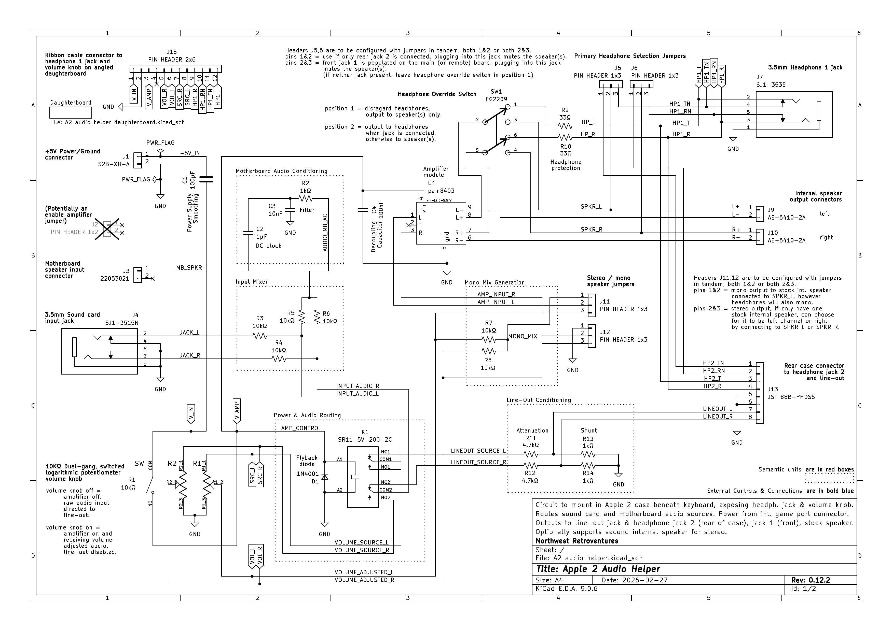
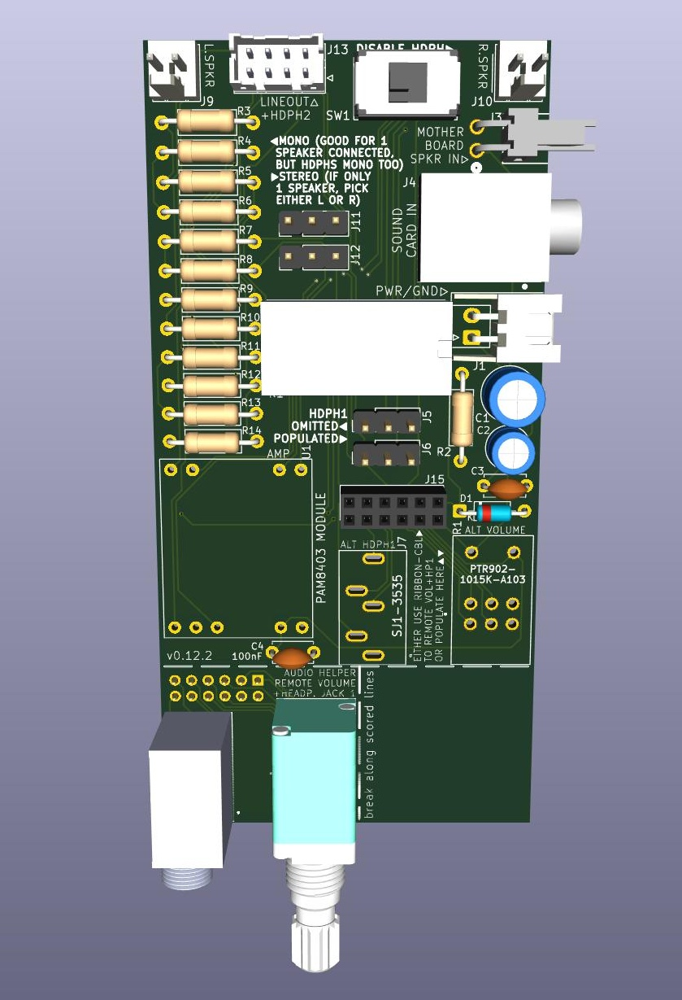

This is a potential Apple II hardware mod I hope to eventually turn into a working physical add-on for any ][, ][+, //e. It’s meant to add these capabilities:

- route sound card audio to the stock speaker
- mixing motherboard audio into the sound card audio (i believe some sound cards don’t come with this feature)
- an optional second speaker mounted into the case for stereo (mounting stretegy not determined yet)
- control volume with a knob protruding through a hole dremel'd into case beneath the keyboard (willing to accept feedack about an alternate volume control and placement, of if volume control should be made optional)
- when volume knob turned off, output to a line-out jack at the back of the case (attached to one of those mounts for a //e, not sure what yet for older ][’s)
- output to headphone jack at the back of the case, also controlled by the volume knob, disabling the speaker(s) when connected (also attached to one of those mounts for a //e, maybe both jacks out one wide slot)
- optionally output to another headphone jack at the front of the case (via a second hole in the case beside the volume knob)

These features should be possible using a small circuit board to be mounted within the case beneath the keyboard with some minor modifications, either one or two holes drilled into the case's metal base, the part that's angled upwards. It should require no controller or firmware, and the plan is to connect it to power and ground via the motherboard’s game port (potentially using a pass-through socket to permit its use for joysticks or whatever else).

The schematic originates from a specification fed to Gemini and a KiCad project created according to its design, making use of a 8403 amplifier module. Needless to say there were numerous back and forth sessions. I created a simple PCB design as a proof of concept; it connects the amplifier module as a daughterboard somehow (with some components underneath to save space, I'm not sure this is possible or a good idea). It seems to be an ok size to fit a //e case between the motherboard and where the flat part of the case ends to angle upwards, over some of the vents, roughly in the center of the case horizontally. There should also be space at the far right side of the vents for an second speaker to be mounted somehow. I haven't investigated ][ / ][+ cases at all yet.

Next I’ll implementing this schematic on a breadboard and. If testing going well, I’ll produce some PCBs. Feedback and assistance are appreciated on the Discussions page for this repo, especially feedback on the schematic and PCB since I really a beginner in all this..

